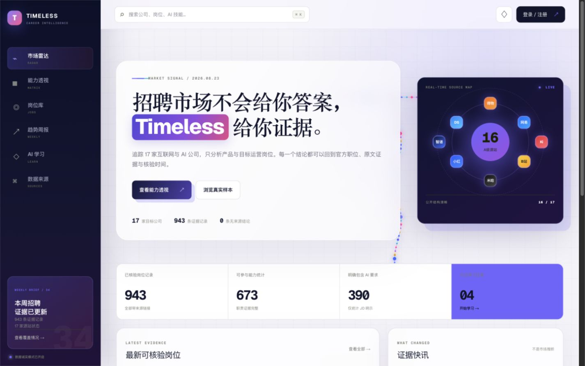
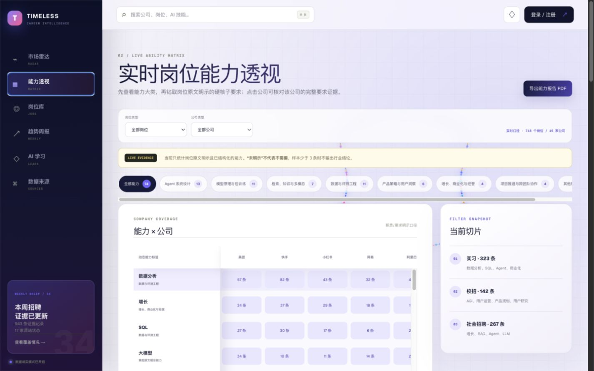
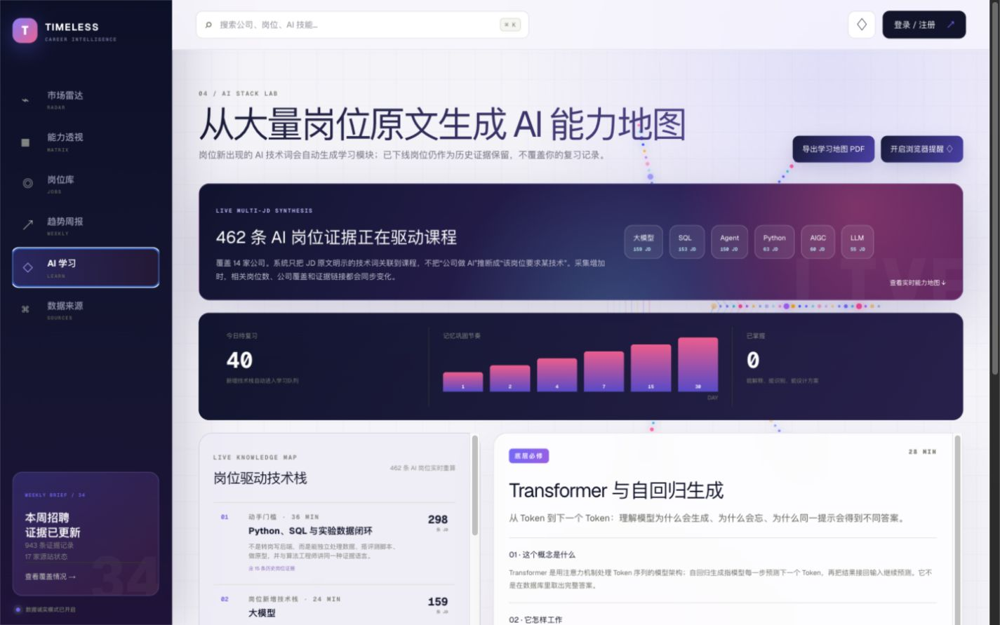

# Timeless

**Evidence-driven career intelligence for product and operations roles in China's technology industry.**

[Live Demo](https://timeless-career-intelligence.vercel.app) · [Report an Issue](https://github.com/VincesHu01/timeless-career-intelligence/issues)

Timeless helps university students and new graduates understand what leading internet and AI companies actually expect from candidates. It continuously turns public recruitment evidence into a searchable job archive, cross-company capability insights, weekly market signals, and practical AI learning paths. Senior, expert, and management roles are also retained as forward-looking career references.

## Product Preview

### Market Radar



Track recruitment coverage, verified job volume, AI-related demand, recent evidence, and source health from one live overview.

### Capability Matrix



Compare concrete capability requirements across companies and recruitment tracks. Every insight is derived from job descriptions and remains traceable to its source.

### AI Learning Lab



Turn AI terms found in real jobs into structured lessons covering what a concept is, how it works, how non-technical roles use it, and which papers or external resources support deeper study.

## What Timeless Does

| Module | What it provides |
| --- | --- |
| **Market Radar** | Live coverage, collection status, evidence freshness, company activity, and high-level hiring signals. |
| **Capability Matrix** | Dynamic capability taxonomy, company-by-capability comparison, recruitment-track filters, and job-level evidence. |
| **Job Library** | A permanent historical archive with company, role family, recruitment type, status, city, evidence, and original job links. |
| **Weekly Report** | Hiring-volume changes, cross-company role clusters, AI-skill demand, and evidence-backed trend summaries. |
| **AI Learning** | Job-driven technology maps, detailed explanations, practical product/operations use cases, papers, and external reading. |
| **Review System** | Ebbinghaus-based learning intervals, browser reminders, progress history, and PDF exports for offline review. |

## Why It Is Useful

- **Evidence before opinion:** conclusions retain source URLs, timestamps, original requirements, and collection status.
- **Cross-company perspective:** similar roles are merged into comparable demand clusters instead of being read as isolated job posts.
- **Dynamic rather than hard-coded:** capability labels, AI stacks, and reports evolve with the underlying job dataset.
- **Built for career decisions:** use it to prioritize projects, strengthen a resume, prepare interviews, compare campus and experienced hiring, or create a focused AI study plan.
- **History is preserved:** offline jobs remain available for seasonal and year-over-year analysis unless a user explicitly removes them.

## Architecture

- React 19, Next.js App Router, TypeScript, responsive CSS, and interactive Canvas particles.
- Drizzle ORM with Cloudflare D1; Vercel can access the same SQLite model through the official D1 REST API.
- Supabase Auth with browser-safe publishable keys and server-side JWT validation.
- Volcengine Ark through its OpenAI-compatible Chat Completions API.
- Browser Notifications, Service Worker reminders, local learning preferences, and PDF export.
- A shared codebase for Next.js/Vercel and Vinext/OpenAI Sites.

## Quick Start

Node.js `>=22.13.0` is required.

```bash
npm ci
cp .env.example .env.local
npm run dev:vercel
```

Open `http://localhost:3000`. Configure the following services in `.env.local`:

- **Supabase Auth:** `NEXT_PUBLIC_SUPABASE_URL` and `NEXT_PUBLIC_SUPABASE_PUBLISHABLE_KEY`.
- **Volcengine Ark:** `ARK_API_KEY`, `ARK_MODEL_ID`, and optionally `ARK_BASE_URL`.
- **Cloudflare D1:** `CLOUDFLARE_ACCOUNT_ID`, `CLOUDFLARE_D1_DATABASE_ID`, and a narrowly scoped `CLOUDFLARE_D1_API_TOKEN`.
- **Scheduled endpoints:** unpredictable values for `CORTEX_CRON_SECRET` and `CORTEX_BACKFILL_SECRET`.

Initialize the remote database before the first run:

```bash
npm run db:setup:remote
```

Never commit secrets. Variables prefixed with `NEXT_PUBLIC_` are exposed to the browser and must never contain a service-role or secret key.

## Deploy

Import the repository into Vercel. The included `vercel.json` uses `npm ci` and `npm run build:vercel`. Add the variables from `.env.example` to the appropriate environments, deploy, and add the final Vercel domain to the Supabase Auth redirect URLs.

If you already run a complete Timeless backend, set only `TIMELESS_BACKEND_ORIGIN=https://your-backend.example`; Vercel will proxy `/api/*` to it, so remote D1 credentials are not required there.

For OpenAI Sites / Cloudflare builds, the `DB` binding is injected through `.openai/hosting.json`:

```bash
npm run dev
npm run build
```

## Verify

```bash
npm run lint
npm run build
npm run build:vercel
npm test
```

Collectors should access only public recruitment pages or public job APIs. Operate the system in accordance with source-site terms, robots directives, rate limits, and applicable personal-information protection requirements.
